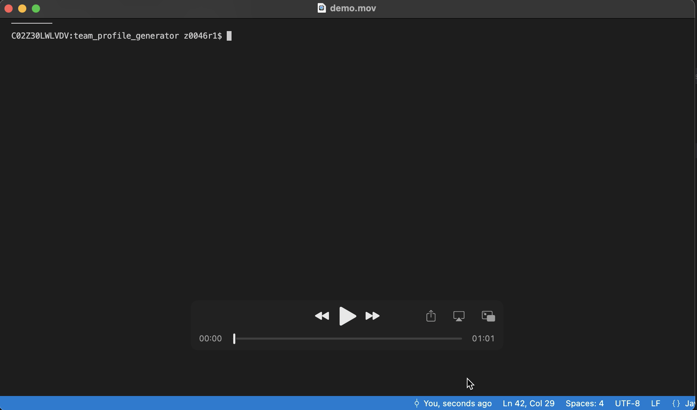
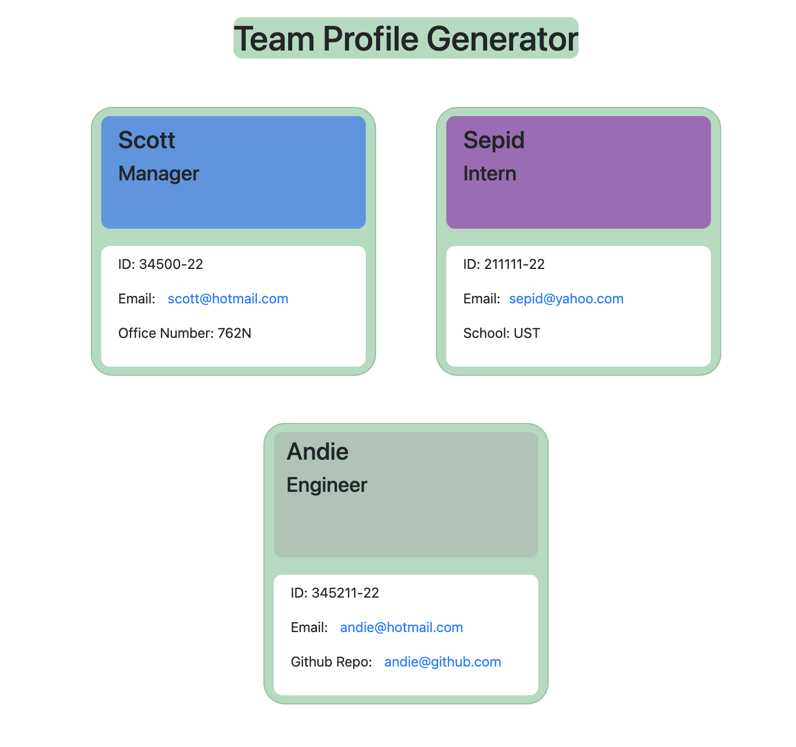

# Team Profile Generator

         <br> 
## User Story
AS A manager
I WANT to generate a webpage that displays my team's basic info
SO THAT I have quick access to their emails and GitHub profiles

## Table of Contents 
1. [About the Project](#About-The-Project)
1. [Project Links](#Project-Links)
1. [Demo](#Demo)
1. [Installation](#Installation)
1. [Usage](#Usage)
1. [Tests](#Tests)
1. [Contribution Guidelines](#Contribution-Guidelines)
1. [Project Team](#Project-Team)
1. [Questions](#Questions)
1. [License](#License)

## About The Project

GIVEN a command-line application that accepts user input
WHEN I am prompted for my team members and their information
THEN an HTML file is generated that displays a nicely formatted team roster based on user input
WHEN I click on an email address in the HTML
THEN my default email program opens and populates the TO field of the email with the address
WHEN I click on the GitHub username
THEN that GitHub profile opens in a new tab
WHEN I start the application
THEN I am prompted to enter the team manager’s name, employee ID, email address, and office number
WHEN I enter the team manager’s name, employee ID, email address, and office number
THEN I am presented with a menu with the option to add an engineer or an intern or to finish building my team
WHEN I select the engineer option
THEN I am prompted to enter the engineer’s name, ID, email, and GitHub username, and I am taken back to the menu
WHEN I select the intern option
THEN I am prompted to enter the intern’s name, ID, email, and school, and I am taken back to the menu
WHEN I decide to finish building my team
THEN I exit the application, and the HTML is generated


## Project Links
[Repo Link](https://github.com/SepidehAyani/team_profile_generator) <br>
[GitHub Project Link](https://github.com/SepidehAyani/team_profile_generator)

## Demo
[](assets/demo.mov)

##### This is a screenshot of the application and how it works: <br>

## Instructions
```  
git clone https://github.com/SepidehAyani/team_profile_generator.git
```

#### Languages and libraries used in this project (separate with commas):
* CSS
* HTML
* Node.js
* JavaScript 
* Inquirer npm

#### Usage:
```  
The project is a command-line application using Inquirer npm which dynamically generates a webpage that displays a team's basic info.
```

#### Tests:
```  
The application will be invoked by using the following in the command line: node index.js
```

#### Contribution Guidelines:
```  
Feel free to contribute to this repo by creating issues or sending an email to sepid.ayani@gmail.com
```

## Questions
<details>
    <summary>Contact</summary>
    sepid.ayani@gmail.com
</details>

## Project Team
[SepidehAyani](https://github.com/SepidehAyani) <br>

## License
#### Distributed under the MIT License. See [Choose A License](https://choosealicense.com/) for more details.